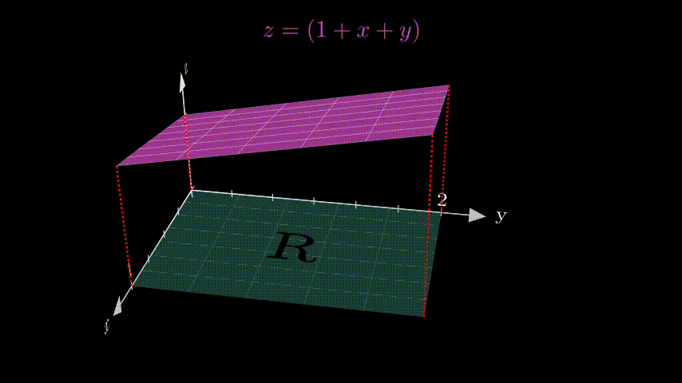

**file1_area_under_func**

**file2_volume_under_surface**

**file3_y_limit_dependent_on_x**

**file4_non_rect_region**

**file5_elementary_area**

**file6_doing_integration**

**file7_int_process_of_example**

