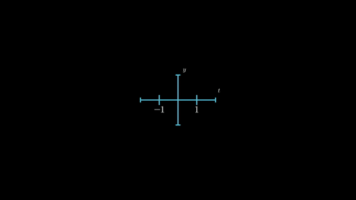
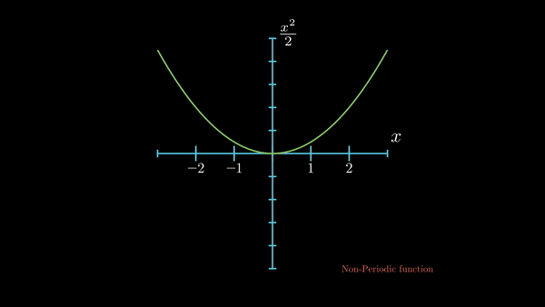
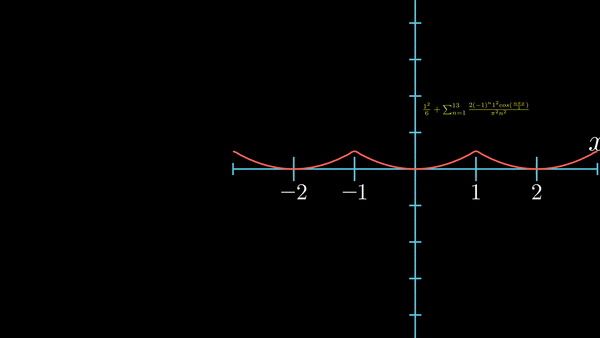
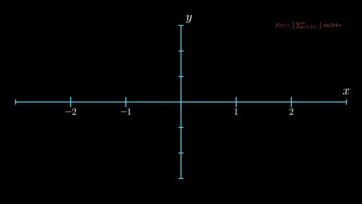
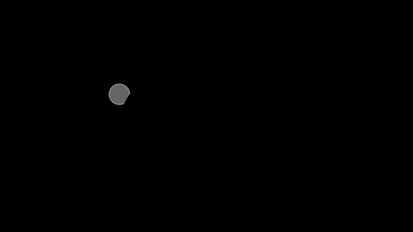

### Dividing a tone into its constituents

### Colors Analogy

### Applying the same on Graphs

### Fourier series for non-periodic functions-a

### Fourier series for non-periodic functions-b

### Fourier Series of Square pulse

### Coins Analogy

